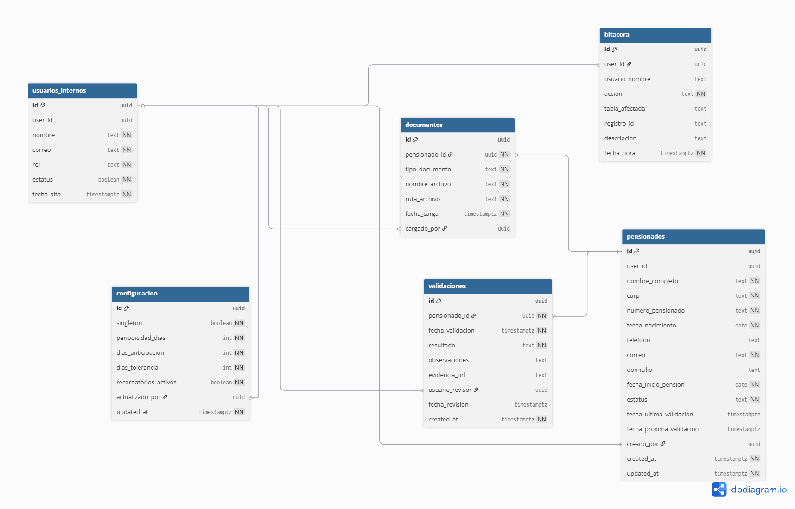

# DOCUMENTACIÓN DE DISEÑO - PROYECTO “PENSIONADOS”

## 1. Arquitectura del Sistema

## 2. Diseño de la Base de Datos

### 2.1 Modelo Entidad - Relación

### 2.2 Diccionario de Datos

#### 2.2.1 Tabla: Configuración

Almacena los parámetros globales que rigen el comportamiento del sistema. Solo permite un registro único.

| **Columna** | **Tipo** | **Restricciones** | **Descripción** |
| --- | --- | --- | --- |
| `id` | UUID | PK, Default | Identificador único. |
| `singleton` | Boolean | Unique, Check (true) | Garantiza que solo exista un registro de configuración. |
| `periodicidad_dias` | Integer | Not Null, Default 90 | Intervalo para las validaciones periódicas. |
| `dias_anticipacion` | Integer | Not Null, Default 15 | Días previos al vencimiento para notificar. |
| `dias_tolerancia` | Integer | Not Null, Default 5 | Margen después del vencimiento antes de marcar como vencida. |
| `recordatorios_activos` | Boolean | Not Null, Default false | Estado del envío automático de notificaciones. |
| `actualizado_por` | UUID | FK (auth.users) | Último administrador en modificar la configuración. |
| `updated_at` | Timestamptz | Default now() | Fecha de última modificación. |

#### 2.2.2 Tabla: Usuarios Internos

Contiene la información de los administradores y operadores que gestionan el aplicativo.

| **Columna** | **Tipo** | **Restricciones** | **Descripción** |
| --- | --- | --- | --- |
| `id` | UUID | PK, Default | Identificador interno. |
| `user_id` | UUID | FK (auth.users), Unique | Vinculación con la tabla de autenticación de Supabase. |
| `nombre` | Text | Not Null | Nombre completo del usuario administrativo. |
| `correo` | Text | Not Null, Unique | Correo electrónico de contacto. |
| `rol` | Text | Check ('admin', 'operador') | Define el nivel de privilegios en el sistema. |
| `estatus` | Boolean | Default true | Estado de la cuenta (activo/inactivo). |
| `fecha_alta` | Timestamptz | Default now() | Fecha de registro en el sistema. |

#### 2.2.3 Tabla: Pensionados

Directorio principal de los beneficiarios del sistema.

| **Columna** | **Tipo** | **Restricciones** | **Descripción** |
| --- | --- | --- | --- |
| `id` | UUID | PK, Default | Identificador único del pensionado. |
| `user_id` | UUID | FK (auth.users), Unique | Vinculación con la cuenta de autenticación (opcional). |
| `nombre_completo` | Text | Not Null | Nombre oficial del beneficiario. |
| `curp` | Text | Not Null, Unique | Clave Única de Registro de Población. |
| `numero_pensionado` | Text | Not Null, Unique | Folio interno o número de identificación de la pensión. |
| `fecha_nacimiento` | Date | Not Null | Fecha de nacimiento del pensionado. |
| `telefono` | Text | - | Teléfono de contacto. |
| `correo` | Text | Not Null | Correo electrónico para notificaciones. |
| `domicilio` | Text | - | Dirección física del beneficiario. |
| `fecha_inicio_pension` | Date | Not Null | Fecha en la que comenzó el goce de la pensión. |
| `estatus` | Text | Default 'activo', Check | Estado del expediente ('activo' o 'inactivo'). |
| `fecha_ultima_validacion` | Timestamptz | - | Fecha del último trámite de supervivencia exitoso. |
| `fecha_proxima_validacion` | Timestamptz | - | Fecha límite calculada para el siguiente trámite. |
| `creado_por` | UUID | FK (auth.users) | Usuario administrativo que realizó el registro inicial. |
| `created_at` | Timestamptz | Default now() | Fecha y hora de creación del registro. |
| `updated_at` | Timestamptz | Default now() | Fecha y hora de la última modificación realizada. |

#### 2.2.4 Tabla: Documentos

Almacena las referencias a los archivos digitales de identificación.

| **Columna** | **Tipo** | **Restricciones** | **Descripción** |
| --- | --- | --- | --- |
| `id` | UUID | PK, Default | Identificador único del documento. |
| `pensionado_id` | UUID | FK (pensionados), Not Null | Relación obligatoria con el pensionado dueño del documento. Incluye eliminación en cascada. |
| `tipo_documento` | Text | Not Null, Default 'credencial' | Clasificación del archivo cargado (ej. credencial, acta, etc.). |
| `nombre_archivo` | Text | Not Null | Nombre original o técnico del archivo para su identificación. |
| `ruta_archivo` | Text | Not Null | Dirección o URL de almacenamiento dentro del bucket de Supabase Storage. |
| `fecha_carga` | Timestamptz | Not Null, Default now() | Estampa de tiempo de cuándo se subió el archivo al sistema. |
| `cargado_por` | UUID | FK (auth.users) | Referencia al usuario (operador o el mismo pensionado) que realizó la carga. |

#### 2.2.5 Tabla: Validaciones

Historial de cada trámite de supervivencia realizado.

| **Columna** | **Tipo** | **Restricciones** | **Descripción** |
| --- | --- | --- | --- |
| `id` | UUID | PK, Default | Identificador único de la validación. |
| `pensionado_id` | UUID | FK (pensionados), Not Null | Referencia al beneficiario. Incluye eliminación en cascada si se borra el pensionado. |
| `fecha_validacion` | Timestamptz | Not Null, Default now() | Fecha y hora en la que el pensionado realiza el registro de supervivencia. |
| `resultado` | Text | Not Null, Check | Resultado del trámite: 'exitosa', 'rechazada', 'en_revision', o 'fuera_de_periodo'. |
| `observaciones` | Text | - | Notas descriptivas o motivos de rechazo añadidos por el sistema o el revisor. |
| `evidencia_url` | Text | - | Ruta o URL de la fotografía o evidencia cargada durante el trámite. |
| `usuario_revisor` | UUID | FK (auth.users) | Identificador del operador o administrador que revisó la validación. |
| `fecha_revision` | Timestamptz | - | Fecha y hora en la que se realizó la revisión técnica del trámite. |
| `created_at` | Timestamptz | Not Null, Default now() | Estampa de tiempo de la creación del registro en la base de datos. |

#### 2.2.6 Tabla: Bitácora

Esta tabla funciona como el registro inmutable de auditoría del sistema, capturando quién hizo qué y cuándo.

| **Columna** | **Tipo** | **Restricciones** | **Descripción** |
| --- | --- | --- | --- |
| `id` | UUID | PK, Default | Identificador único del evento de auditoría. |
| `user_id` | UUID | FK (auth.users) | ID del usuario que realizó la acción (si aplica). |
| `usuario_nombre` | Text | - | Nombre legible del usuario al momento de la acción. |
| `accion` | Text | Not Null | Tipo de operación (ej. 'login', 'alta_pensionado', 'modificar_config'). |
| `tabla_afectada` | Text | - | Nombre de la tabla donde ocurrió el cambio. |
| `registro_id` | Text | - | UUID o ID del registro específico que fue afectado. |
| `descripcion` | Text | - | Detalle técnico o humano de la operación realizada. |
| `fecha_hora` | Timestamptz | Not Null, Default now() | Estampa de tiempo exacta del evento. |

### 2.3 Lógica de la Base

### **2.3.1 Políticas de Seguridad**

#### **2.3.1.1 Nombre: acceso_pensionado**

Tabla: pensionados

Tipo: SELECT

Descripción: Permite a los pensionados consultar únicamente su propia información.

Condición: user_id = auth.uid()

Rol: pensionado

#### **2.3.1.2 Nombre: actualizacion_pensionado**

Tabla: pensionados

Tipo: UPDATE

Descripción: Permite a un pensionado actualizar únicamente sus propios datos personales (correo, teléfono, domicilio).

Condición: user_id = auth.uid()

Rol: pensionado

#### **2.3.1.3 Nombre: acceso_admin_pensionados**

Tabla: pensionados

Tipo: ALL

Descripción: Permite a usuarios internos con rol administrador gestionar todos los registros de pensionados.

Condición: rol = 'admin'

Rol: admin

#### **2.3.1.4 Nombre: acceso_documentos_propios**

Tabla: documentos

Tipo: SELECT

Descripción: Permite a un pensionado consultar únicamente sus documentos asociados.

Condición: pensionado_id IN (SELECT id FROM pensionados WHERE user_id = auth.uid())

Rol: pensionado

#### **2.3.1.5 Nombre: carga_documentos_pensionado**

Tabla: documentos

Tipo: INSERT

Descripción: Permite a un pensionado subir documentos asociados a su propio registro.

Condición: pensionado_id IN (SELECT id FROM pensionados WHERE user_id = auth.uid())

Rol: pensionado

#### **2.3.1.6 Nombre: acceso_validaciones_admin**

Tabla: validaciones

Tipo: ALL

Descripción: Permite a usuarios internos revisar y gestionar validaciones de pensionados.

Condición: rol IN ('admin', 'operador')

Rol: admin, operador

#### **2.3.1.7 Nombre: acceso_bitacora_admin**

Tabla: bitacora

Tipo: SELECT

Descripción: Permite únicamente a administradores consultar la bitácora del sistema.

Condición: rol = 'admin'

Rol: admin

### **2.3.2 Disparadores**

#### **2.3.2.1 Nombre: trg_actualizar_fechas_validacion**

Tabla: pensionados

Evento: UPDATE

Momento: AFTER

Descripción: Actualiza automáticamente la fecha de última y próxima validación cuando se registra una validación exitosa.

Función asociada: fn_actualizar_fechas_validacion()

#### **2.3.2.2 Nombre: trg_registrar_bitacora_pensionados**

Tabla: pensionados

Evento: INSERT, UPDATE, DELETE

Momento: AFTER

Descripción: Registra en la bitácora cualquier cambio realizado sobre la tabla pensionados.

Función asociada: fn_registrar_bitacora()

#### **2.3.2.3 Nombre: trg_registrar_bitacora_validaciones**

Tabla: validaciones

Evento: INSERT, UPDATE

Momento: AFTER

Descripción: Registra en la bitácora las acciones relacionadas con validaciones de pensionados.

Función asociada: fn_registrar_bitacora()

#### **2.3.2.4 Nombre: trg_validar_periodo**

Tabla: validaciones

Evento: INSERT

Momento: BEFORE

Descripción: Verifica que la validación se realice dentro del periodo permitido antes de ser registrada.

Función asociada: fn_validar_periodo()

#### **2.3.2.5 Nombre: trg_actualizar_updated_at**

Tabla: pensionados

Evento: UPDATE

Momento: BEFORE

Descripción: Actualiza automáticamente el campo updated_at al momento de modificar un registro.

Función asociada: fn_actualizar_timestamp()

### **2.3.3 Procedimientos**

#### **2.3.3.1 Nombre: fn_actualizar_fechas_validacion**

Tipo: FUNCTION

Parámetros: pensionado_id UUID

Retorno: VOID

Descripción: Calcula y actualiza la fecha de última validación y la próxima validación en función de la configuración del sistema.

Uso: Se invoca automáticamente después de registrar una validación exitosa.

#### **2.3.3.2 Nombre: fn_registrar_bitacora**

Tipo: FUNCTION

Parámetros: ninguno (usa contexto del trigger)

Retorno: TRIGGER

Descripción: Registra información sobre la operación realizada (usuario, acción, tabla afectada, fecha) en la tabla bitácora.

Uso: Se ejecuta automáticamente en operaciones INSERT, UPDATE o DELETE.

#### **2.3.3.3 Nombre: fn_validar_periodo**

Tipo: FUNCTION

Parámetros: pensionado_id UUID

Retorno: BOOLEAN

Descripción: Verifica si la validación se encuentra dentro del periodo permitido considerando tolerancias y configuración.

Uso: Se ejecuta antes de insertar una validación.

#### **2.3.3.4 Nombre: fn_actualizar_timestamp**

Tipo: FUNCTION

Parámetros: ninguno

Retorno: TRIGGER

Descripción: Actualiza automáticamente el campo updated_at con la fecha y hora actual.

Uso: Se ejecuta antes de actualizar registros en tablas que requieren control de modificación.

#### **2.3.3.5 Nombre: sp_registrar_validacion**

Tipo: PROCEDURE

Parámetros: pensionado_id UUID, usuario_revisor UUID, resultado TEXT

Retorno: VOID

Descripción: Registra una validación de pensionado, ejecutando las verificaciones necesarias y actualizando estados relacionados.

Uso: Invocado desde la lógica de negocio del backend.

### **2.3.4 Reglas de Negocio Implementadas en Base de Datos**

- Un pensionado solo puede acceder a su propia información.
- Los documentos están restringidos al propietario del registro.
- Las validaciones deben realizarse dentro de un periodo definido.
- Cada acción relevante se registra en la bitácora para auditoría.
- Las fechas de validación se actualizan automáticamente tras una validación exitosa.
- Solo usuarios internos con rol autorizado pueden gestionar validaciones.

## 3. Diseño de Interfaz

### 3.1 Jerarquía de Pantallas

## 4. Diagrama de Secuencia